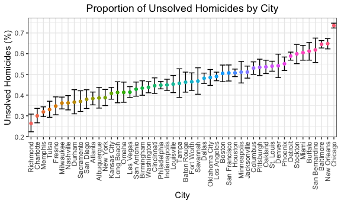

p8105\_hw5\_aar2192
================
Amadeia Rector
11/6/2018

Problem 1
=========

Part A
------

-   Start with a dataframe containing all file names; the list.files function will help

``` r
longitudinal_df =
    tibble(file_name = list.files(path = "./data")) 
```

This created a data frame with just the names of the csv files.

Part B
------

-   Iterate over file names and read in data for each subject using purrr::map and saving the result as a new variable in the dataframe

``` r
  longitudinal_df =
    tibble(participant = list.files(path = "./data"),
           csv_file = str_c(path = "./data/", participant)) %>% 
    mutate(data = map(csv_file, read_csv)) %>% 
    unnest 
## Parsed with column specification:
## cols(
##   week_1 = col_double(),
##   week_2 = col_double(),
##   week_3 = col_double(),
##   week_4 = col_double(),
##   week_5 = col_double(),
##   week_6 = col_double(),
##   week_7 = col_double(),
##   week_8 = col_double()
## )
## Parsed with column specification:
## cols(
##   week_1 = col_double(),
##   week_2 = col_double(),
##   week_3 = col_double(),
##   week_4 = col_double(),
##   week_5 = col_double(),
##   week_6 = col_double(),
##   week_7 = col_double(),
##   week_8 = col_double()
## )
## Parsed with column specification:
## cols(
##   week_1 = col_double(),
##   week_2 = col_double(),
##   week_3 = col_double(),
##   week_4 = col_double(),
##   week_5 = col_double(),
##   week_6 = col_double(),
##   week_7 = col_double(),
##   week_8 = col_double()
## )
## Parsed with column specification:
## cols(
##   week_1 = col_double(),
##   week_2 = col_double(),
##   week_3 = col_double(),
##   week_4 = col_double(),
##   week_5 = col_double(),
##   week_6 = col_double(),
##   week_7 = col_double(),
##   week_8 = col_double()
## )
## Parsed with column specification:
## cols(
##   week_1 = col_double(),
##   week_2 = col_double(),
##   week_3 = col_double(),
##   week_4 = col_double(),
##   week_5 = col_double(),
##   week_6 = col_double(),
##   week_7 = col_double(),
##   week_8 = col_double()
## )
## Parsed with column specification:
## cols(
##   week_1 = col_double(),
##   week_2 = col_double(),
##   week_3 = col_double(),
##   week_4 = col_double(),
##   week_5 = col_double(),
##   week_6 = col_double(),
##   week_7 = col_double(),
##   week_8 = col_double()
## )
## Parsed with column specification:
## cols(
##   week_1 = col_double(),
##   week_2 = col_double(),
##   week_3 = col_double(),
##   week_4 = col_double(),
##   week_5 = col_double(),
##   week_6 = col_double(),
##   week_7 = col_double(),
##   week_8 = col_double()
## )
## Parsed with column specification:
## cols(
##   week_1 = col_double(),
##   week_2 = col_double(),
##   week_3 = col_double(),
##   week_4 = col_double(),
##   week_5 = col_double(),
##   week_6 = col_double(),
##   week_7 = col_double(),
##   week_8 = col_double()
## )
## Parsed with column specification:
## cols(
##   week_1 = col_double(),
##   week_2 = col_double(),
##   week_3 = col_double(),
##   week_4 = col_double(),
##   week_5 = col_double(),
##   week_6 = col_double(),
##   week_7 = col_double(),
##   week_8 = col_double()
## )
## Parsed with column specification:
## cols(
##   week_1 = col_double(),
##   week_2 = col_double(),
##   week_3 = col_double(),
##   week_4 = col_double(),
##   week_5 = col_double(),
##   week_6 = col_double(),
##   week_7 = col_double(),
##   week_8 = col_double()
## )
## Parsed with column specification:
## cols(
##   week_1 = col_double(),
##   week_2 = col_double(),
##   week_3 = col_double(),
##   week_4 = col_double(),
##   week_5 = col_double(),
##   week_6 = col_double(),
##   week_7 = col_double(),
##   week_8 = col_double()
## )
## Parsed with column specification:
## cols(
##   week_1 = col_double(),
##   week_2 = col_double(),
##   week_3 = col_double(),
##   week_4 = col_double(),
##   week_5 = col_double(),
##   week_6 = col_double(),
##   week_7 = col_double(),
##   week_8 = col_double()
## )
## Parsed with column specification:
## cols(
##   week_1 = col_double(),
##   week_2 = col_double(),
##   week_3 = col_double(),
##   week_4 = col_double(),
##   week_5 = col_double(),
##   week_6 = col_double(),
##   week_7 = col_double(),
##   week_8 = col_double()
## )
## Parsed with column specification:
## cols(
##   week_1 = col_double(),
##   week_2 = col_double(),
##   week_3 = col_double(),
##   week_4 = col_double(),
##   week_5 = col_double(),
##   week_6 = col_double(),
##   week_7 = col_integer(),
##   week_8 = col_double()
## )
## Parsed with column specification:
## cols(
##   week_1 = col_double(),
##   week_2 = col_double(),
##   week_3 = col_double(),
##   week_4 = col_double(),
##   week_5 = col_double(),
##   week_6 = col_double(),
##   week_7 = col_double(),
##   week_8 = col_double()
## )
## Parsed with column specification:
## cols(
##   week_1 = col_double(),
##   week_2 = col_double(),
##   week_3 = col_double(),
##   week_4 = col_double(),
##   week_5 = col_double(),
##   week_6 = col_double(),
##   week_7 = col_double(),
##   week_8 = col_double()
## )
## Parsed with column specification:
## cols(
##   week_1 = col_double(),
##   week_2 = col_double(),
##   week_3 = col_double(),
##   week_4 = col_double(),
##   week_5 = col_double(),
##   week_6 = col_double(),
##   week_7 = col_double(),
##   week_8 = col_double()
## )
## Parsed with column specification:
## cols(
##   week_1 = col_double(),
##   week_2 = col_double(),
##   week_3 = col_double(),
##   week_4 = col_double(),
##   week_5 = col_double(),
##   week_6 = col_double(),
##   week_7 = col_double(),
##   week_8 = col_double()
## )
## Parsed with column specification:
## cols(
##   week_1 = col_double(),
##   week_2 = col_double(),
##   week_3 = col_double(),
##   week_4 = col_double(),
##   week_5 = col_double(),
##   week_6 = col_double(),
##   week_7 = col_double(),
##   week_8 = col_double()
## )
## Parsed with column specification:
## cols(
##   week_1 = col_double(),
##   week_2 = col_double(),
##   week_3 = col_double(),
##   week_4 = col_double(),
##   week_5 = col_double(),
##   week_6 = col_double(),
##   week_7 = col_double(),
##   week_8 = col_double()
## )
```

Using map, I read a string with the complete file names using the "read\_csv" function.

Part C
------

-   Tidy the result; manipulate file names to include control arm and subject ID, make sure weekly observations are “tidy”, and do any other tidying that’s necessary

``` r
longitudinal_df =
    tibble(participant = list.files(path = "./data"),
           csv_file = str_c(path = "./data/", participant)) %>% 
    mutate(data = map(csv_file, read_csv)) %>% 
    unnest %>%
    separate(participant, into = c("participant_id", "trash"), sep = ".c") %>% 
  mutate(study_arm = participant_id) %>%
  mutate(study_arm = str_replace(study_arm, "con", "control")) %>% 
  mutate(study_arm = str_replace(study_arm, "exp", "experiment")) %>% 
  separate(study_arm, into = c("study_arm", "trash1"), sep = "_") %>% 
  select(participant_id, study_arm, everything(), -starts_with("trash"), -csv_file) %>% 
  janitor::clean_names() %>% 
  gather(key = week, value = observation, week_1:week_8) %>% 
  separate(week, into = c("trash", "week"), sep = "_") %>% 
  select(-trash) 
## Parsed with column specification:
## cols(
##   week_1 = col_double(),
##   week_2 = col_double(),
##   week_3 = col_double(),
##   week_4 = col_double(),
##   week_5 = col_double(),
##   week_6 = col_double(),
##   week_7 = col_double(),
##   week_8 = col_double()
## )
## Parsed with column specification:
## cols(
##   week_1 = col_double(),
##   week_2 = col_double(),
##   week_3 = col_double(),
##   week_4 = col_double(),
##   week_5 = col_double(),
##   week_6 = col_double(),
##   week_7 = col_double(),
##   week_8 = col_double()
## )
## Parsed with column specification:
## cols(
##   week_1 = col_double(),
##   week_2 = col_double(),
##   week_3 = col_double(),
##   week_4 = col_double(),
##   week_5 = col_double(),
##   week_6 = col_double(),
##   week_7 = col_double(),
##   week_8 = col_double()
## )
## Parsed with column specification:
## cols(
##   week_1 = col_double(),
##   week_2 = col_double(),
##   week_3 = col_double(),
##   week_4 = col_double(),
##   week_5 = col_double(),
##   week_6 = col_double(),
##   week_7 = col_double(),
##   week_8 = col_double()
## )
## Parsed with column specification:
## cols(
##   week_1 = col_double(),
##   week_2 = col_double(),
##   week_3 = col_double(),
##   week_4 = col_double(),
##   week_5 = col_double(),
##   week_6 = col_double(),
##   week_7 = col_double(),
##   week_8 = col_double()
## )
## Parsed with column specification:
## cols(
##   week_1 = col_double(),
##   week_2 = col_double(),
##   week_3 = col_double(),
##   week_4 = col_double(),
##   week_5 = col_double(),
##   week_6 = col_double(),
##   week_7 = col_double(),
##   week_8 = col_double()
## )
## Parsed with column specification:
## cols(
##   week_1 = col_double(),
##   week_2 = col_double(),
##   week_3 = col_double(),
##   week_4 = col_double(),
##   week_5 = col_double(),
##   week_6 = col_double(),
##   week_7 = col_double(),
##   week_8 = col_double()
## )
## Parsed with column specification:
## cols(
##   week_1 = col_double(),
##   week_2 = col_double(),
##   week_3 = col_double(),
##   week_4 = col_double(),
##   week_5 = col_double(),
##   week_6 = col_double(),
##   week_7 = col_double(),
##   week_8 = col_double()
## )
## Parsed with column specification:
## cols(
##   week_1 = col_double(),
##   week_2 = col_double(),
##   week_3 = col_double(),
##   week_4 = col_double(),
##   week_5 = col_double(),
##   week_6 = col_double(),
##   week_7 = col_double(),
##   week_8 = col_double()
## )
## Parsed with column specification:
## cols(
##   week_1 = col_double(),
##   week_2 = col_double(),
##   week_3 = col_double(),
##   week_4 = col_double(),
##   week_5 = col_double(),
##   week_6 = col_double(),
##   week_7 = col_double(),
##   week_8 = col_double()
## )
## Parsed with column specification:
## cols(
##   week_1 = col_double(),
##   week_2 = col_double(),
##   week_3 = col_double(),
##   week_4 = col_double(),
##   week_5 = col_double(),
##   week_6 = col_double(),
##   week_7 = col_double(),
##   week_8 = col_double()
## )
## Parsed with column specification:
## cols(
##   week_1 = col_double(),
##   week_2 = col_double(),
##   week_3 = col_double(),
##   week_4 = col_double(),
##   week_5 = col_double(),
##   week_6 = col_double(),
##   week_7 = col_double(),
##   week_8 = col_double()
## )
## Parsed with column specification:
## cols(
##   week_1 = col_double(),
##   week_2 = col_double(),
##   week_3 = col_double(),
##   week_4 = col_double(),
##   week_5 = col_double(),
##   week_6 = col_double(),
##   week_7 = col_double(),
##   week_8 = col_double()
## )
## Parsed with column specification:
## cols(
##   week_1 = col_double(),
##   week_2 = col_double(),
##   week_3 = col_double(),
##   week_4 = col_double(),
##   week_5 = col_double(),
##   week_6 = col_double(),
##   week_7 = col_integer(),
##   week_8 = col_double()
## )
## Parsed with column specification:
## cols(
##   week_1 = col_double(),
##   week_2 = col_double(),
##   week_3 = col_double(),
##   week_4 = col_double(),
##   week_5 = col_double(),
##   week_6 = col_double(),
##   week_7 = col_double(),
##   week_8 = col_double()
## )
## Parsed with column specification:
## cols(
##   week_1 = col_double(),
##   week_2 = col_double(),
##   week_3 = col_double(),
##   week_4 = col_double(),
##   week_5 = col_double(),
##   week_6 = col_double(),
##   week_7 = col_double(),
##   week_8 = col_double()
## )
## Parsed with column specification:
## cols(
##   week_1 = col_double(),
##   week_2 = col_double(),
##   week_3 = col_double(),
##   week_4 = col_double(),
##   week_5 = col_double(),
##   week_6 = col_double(),
##   week_7 = col_double(),
##   week_8 = col_double()
## )
## Parsed with column specification:
## cols(
##   week_1 = col_double(),
##   week_2 = col_double(),
##   week_3 = col_double(),
##   week_4 = col_double(),
##   week_5 = col_double(),
##   week_6 = col_double(),
##   week_7 = col_double(),
##   week_8 = col_double()
## )
## Parsed with column specification:
## cols(
##   week_1 = col_double(),
##   week_2 = col_double(),
##   week_3 = col_double(),
##   week_4 = col_double(),
##   week_5 = col_double(),
##   week_6 = col_double(),
##   week_7 = col_double(),
##   week_8 = col_double()
## )
## Parsed with column specification:
## cols(
##   week_1 = col_double(),
##   week_2 = col_double(),
##   week_3 = col_double(),
##   week_4 = col_double(),
##   week_5 = col_double(),
##   week_6 = col_double(),
##   week_7 = col_double(),
##   week_8 = col_double()
## )
```

Building on Part B, I tidied my newly created data set by renaming some variables, removing unnecessary variables, creating a variable based on study arm, and gathering the week variables into one column.

Part D
------

-   Make a spaghetti plot showing observations on each subject over time, and comment on differences between groups.

``` r
longitudinal_df %>% 
  ggplot(aes(x = week, y = observation, group = participant_id, color = study_arm)) +
  geom_path() + 
  labs(title = "Observations over Time per Subject",
       x = "Time (weeks)",
       y = "Observations") + 
  viridis::scale_color_viridis(
    name = "Study arm", 
    discrete = TRUE) +
  theme(plot.title = element_text(hjust = 0.5))
```


### Plot description:

Given the spaghetti plot above, it appears that subjects in the **"experiment"** arm have *higher* observations overall compared to the **"control"** arm.

While there is some overlap/crossing of lines between the "control" and "experiment" subjects with regard to observations, it seems that the highest observation among subjects in the "control" arm is at around 4.5 compared to above 7.5 among subjects in the "experiment" arm. The lowest observation is slightly above -2.5 among subjects in the "control" arm compared to just above -1 among subjects in the "experiment" arm.

Problem 2
=========

Part A
------

-   Describe the raw data.

``` r
wp_murders_df = read_csv("https://raw.githubusercontent.com/washingtonpost/data-homicides/master/homicide-data.csv")
## Parsed with column specification:
## cols(
##   uid = col_character(),
##   reported_date = col_integer(),
##   victim_last = col_character(),
##   victim_first = col_character(),
##   victim_race = col_character(),
##   victim_age = col_character(),
##   victim_sex = col_character(),
##   city = col_character(),
##   state = col_character(),
##   lat = col_double(),
##   lon = col_double(),
##   disposition = col_character()
## )

str(wp_murders_df)
## Classes 'tbl_df', 'tbl' and 'data.frame':    52179 obs. of  12 variables:
##  $ uid          : chr  "Alb-000001" "Alb-000002" "Alb-000003" "Alb-000004" ...
##  $ reported_date: int  20100504 20100216 20100601 20100101 20100102 20100126 20100127 20100127 20100130 20100210 ...
##  $ victim_last  : chr  "GARCIA" "MONTOYA" "SATTERFIELD" "MENDIOLA" ...
##  $ victim_first : chr  "JUAN" "CAMERON" "VIVIANA" "CARLOS" ...
##  $ victim_race  : chr  "Hispanic" "Hispanic" "White" "Hispanic" ...
##  $ victim_age   : chr  "78" "17" "15" "32" ...
##  $ victim_sex   : chr  "Male" "Male" "Female" "Male" ...
##  $ city         : chr  "Albuquerque" "Albuquerque" "Albuquerque" "Albuquerque" ...
##  $ state        : chr  "NM" "NM" "NM" "NM" ...
##  $ lat          : num  35.1 35.1 35.1 35.1 35.1 ...
##  $ lon          : num  -107 -107 -107 -107 -107 ...
##  $ disposition  : chr  "Closed without arrest" "Closed by arrest" "Closed without arrest" "Closed by arrest" ...
##  - attr(*, "spec")=List of 2
##   ..$ cols   :List of 12
##   .. ..$ uid          : list()
##   .. .. ..- attr(*, "class")= chr  "collector_character" "collector"
##   .. ..$ reported_date: list()
##   .. .. ..- attr(*, "class")= chr  "collector_integer" "collector"
##   .. ..$ victim_last  : list()
##   .. .. ..- attr(*, "class")= chr  "collector_character" "collector"
##   .. ..$ victim_first : list()
##   .. .. ..- attr(*, "class")= chr  "collector_character" "collector"
##   .. ..$ victim_race  : list()
##   .. .. ..- attr(*, "class")= chr  "collector_character" "collector"
##   .. ..$ victim_age   : list()
##   .. .. ..- attr(*, "class")= chr  "collector_character" "collector"
##   .. ..$ victim_sex   : list()
##   .. .. ..- attr(*, "class")= chr  "collector_character" "collector"
##   .. ..$ city         : list()
##   .. .. ..- attr(*, "class")= chr  "collector_character" "collector"
##   .. ..$ state        : list()
##   .. .. ..- attr(*, "class")= chr  "collector_character" "collector"
##   .. ..$ lat          : list()
##   .. .. ..- attr(*, "class")= chr  "collector_double" "collector"
##   .. ..$ lon          : list()
##   .. .. ..- attr(*, "class")= chr  "collector_double" "collector"
##   .. ..$ disposition  : list()
##   .. .. ..- attr(*, "class")= chr  "collector_character" "collector"
##   ..$ default: list()
##   .. ..- attr(*, "class")= chr  "collector_guess" "collector"
##   ..- attr(*, "class")= chr "col_spec"

table(wp_murders_df$victim_sex)
## 
##  Female    Male Unknown 
##    7209   40739    4231
unique(wp_murders_df$city)
##  [1] "Albuquerque"    "Atlanta"        "Baltimore"      "Baton Rouge"   
##  [5] "Birmingham"     "Boston"         "Buffalo"        "Charlotte"     
##  [9] "Chicago"        "Cincinnati"     "Columbus"       "Dallas"        
## [13] "Denver"         "Detroit"        "Durham"         "Fort Worth"    
## [17] "Fresno"         "Houston"        "Indianapolis"   "Jacksonville"  
## [21] "Kansas City"    "Las Vegas"      "Long Beach"     "Los Angeles"   
## [25] "Louisville"     "Memphis"        "Miami"          "Milwaukee"     
## [29] "Minneapolis"    "Nashville"      "New Orleans"    "New York"      
## [33] "Oakland"        "Oklahoma City"  "Omaha"          "Philadelphia"  
## [37] "Phoenix"        "Pittsburgh"     "Richmond"       "San Antonio"   
## [41] "Sacramento"     "Savannah"       "San Bernardino" "San Diego"     
## [45] "San Francisco"  "St. Louis"      "Stockton"       "Tampa"         
## [49] "Tulsa"          "Washington"
unique(wp_murders_df$state)
##  [1] "NM" "GA" "MD" "LA" "AL" "MA" "NY" "NC" "IL" "OH" "TX" "CO" "MI" "CA"
## [15] "IN" "FL" "MO" "NV" "KY" "TN" "wI" "MN" "OK" "NE" "PA" "AZ" "VA" "DC"
summary(as.numeric(wp_murders_df$victim_age), na.rm = TRUE)
## Warning in summary(as.numeric(wp_murders_df$victim_age), na.rm = TRUE): NAs
## introduced by coercion
##    Min. 1st Qu.  Median    Mean 3rd Qu.    Max.    NA's 
##     0.0    22.0    28.0    31.8    40.0   102.0    2999
sort(table(wp_murders_df$city), decreasing = TRUE)
## 
##        Chicago   Philadelphia        Houston      Baltimore        Detroit 
##           5535           3037           2942           2827           2519 
##    Los Angeles      St. Louis         Dallas        Memphis    New Orleans 
##           2257           1677           1567           1514           1434 
##      Las Vegas     Washington   Indianapolis    Kansas City   Jacksonville 
##           1381           1345           1322           1190           1168 
##      Milwaukee       Columbus        Atlanta        Oakland        Phoenix 
##           1115           1084            973            947            914 
##    San Antonio     Birmingham      Nashville          Miami     Cincinnati 
##            833            800            767            744            694 
##      Charlotte  Oklahoma City  San Francisco     Pittsburgh       New York 
##            687            672            663            631            627 
##         Boston          Tulsa     Louisville     Fort Worth        Buffalo 
##            614            584            576            549            521 
##         Fresno      San Diego       Stockton       Richmond    Baton Rouge 
##            487            461            444            429            424 
##          Omaha    Albuquerque     Long Beach     Sacramento    Minneapolis 
##            409            378            378            376            366 
##         Denver         Durham San Bernardino       Savannah          Tampa 
##            312            276            275            246            208
sort(table(wp_murders_df$victim_race), decreasing = TRUE)
## 
##    Black Hispanic    White  Unknown    Other    Asian 
##    33361     6901     6333     4199      700      685
```

There are **52179 observations** with **12 variables** in this dataset, which are "uid", "reported\_date", "victim\_last", "victim\_first", "victim\_race", victim\_age", "victim\_sex", "city", "state", "lat", "lon", and "disposition".
The data include the *location* of the killing (which is defined by 4 variables "city", "state", "lat", and "lon"), whether an *arrest* was made (defined by the variable "disposition"), the *reported date* of the homicide ("reported\_date") and information about each victim, such as *name*, *race*, *sex*, *age*, and their *homicide ID* (captured by the variables "victim\_last", "victim\_first", "victim\_race", victim\_sex" "victim\_age", and "uid").

Of the 52,179 homicides, **7209** were female, **40739** were male, and 4,231 were unknown. The data came from **50 large cities** from **28 states**. The homicides span from *2007* to *2017* for most cities. Ages of homicides ranged from **0** (presumed to be less than a year old) to **102**, with a median of **28 years of age**. There were 2999 homicides without age reported (NA's). The 5 cities with the most homicides were *Chicago* (5535), *Philadelphia* (3037), *Houston* (2942), *Baltimore* (2827), and *Detroit* (2519). Most of the homicide victims were of Black race (33361).

Part B
------

-   Create a city\_state variable (e.g. “Baltimore, MD”)

``` r
wp_murders_df =
  wp_murders_df %>% 
  mutate(state = replace(state, city=="Tulsa", "OK")) %>% 
  mutate(city_state = paste(city, state, sep = "_")) %>% 
  select(uid:lon, city, state, city_state, disposition)
  

summary(unique(wp_murders_df$city_state))
##    Length     Class      Mode 
##        50 character character
sort(table(wp_murders_df$city_state), decreasing = TRUE)
## 
##        Chicago_IL   Philadelphia_PA        Houston_TX      Baltimore_MD 
##              5535              3037              2942              2827 
##        Detroit_MI    Los Angeles_CA      St. Louis_MO         Dallas_TX 
##              2519              2257              1677              1567 
##        Memphis_TN    New Orleans_LA      Las Vegas_NV     Washington_DC 
##              1514              1434              1381              1345 
##   Indianapolis_IN    Kansas City_MO   Jacksonville_FL      Milwaukee_wI 
##              1322              1190              1168              1115 
##       Columbus_OH        Atlanta_GA        Oakland_CA        Phoenix_AZ 
##              1084               973               947               914 
##    San Antonio_TX     Birmingham_AL      Nashville_TN          Miami_FL 
##               833               800               767               744 
##     Cincinnati_OH      Charlotte_NC  Oklahoma City_OK  San Francisco_CA 
##               694               687               672               663 
##     Pittsburgh_PA       New York_NY         Boston_MA          Tulsa_OK 
##               631               627               614               584 
##     Louisville_KY     Fort Worth_TX        Buffalo_NY         Fresno_CA 
##               576               549               521               487 
##      San Diego_CA       Stockton_CA       Richmond_VA    Baton Rouge_LA 
##               461               444               429               424 
##          Omaha_NE    Albuquerque_NM     Long Beach_CA     Sacramento_CA 
##               409               378               378               376 
##    Minneapolis_MN         Denver_CO         Durham_NC San Bernardino_CA 
##               366               312               276               275 
##       Savannah_GA          Tampa_FL 
##               246               208
```

A new variable, "city\_state", has been created using mutate and paste. When originally creating the new variable, it was noticed that there were 51 unique values for "city\_state" as opposed to 50 (this was discovered by looking at the commands "unique(wp\_murders\_df$city\_state)" and "sort(table(wp\_murders\_df$city\_state), decreasing = TRUE)". It seems that for one observation, the city Tulsa was accidentally cross referenced to AL instead of OK. This was corrected.

Part C
------

-   Summarize within cities to obtain the total number of homicides and the number of unsolved homicides (those for which the disposition is “Closed without arrest” or “Open/No arrest”).

``` r
wp_murders_df %>% 
  group_by(city, disposition) %>% 
  summarize(n = n()) %>% 
  spread(key = disposition, value = n) %>% 
  janitor::clean_names() %>% 
  mutate(n_unsolved = sum(closed_without_arrest, open_no_arrest, na.rm=TRUE)) %>% 
  mutate(n_homicide = sum(closed_without_arrest, open_no_arrest, closed_by_arrest, na.rm=TRUE)) %>% 
  select(-closed_by_arrest, -closed_without_arrest, -open_no_arrest) %>% 
  arrange(-n_unsolved)
## # A tibble: 50 x 3
## # Groups:   city [50]
##    city         n_unsolved n_homicide
##    <chr>             <int>      <int>
##  1 Chicago            4073       5535
##  2 Baltimore          1825       2827
##  3 Houston            1493       2942
##  4 Detroit            1482       2519
##  5 Philadelphia       1360       3037
##  6 Los Angeles        1106       2257
##  7 New Orleans         930       1434
##  8 St. Louis           905       1677
##  9 Dallas              754       1567
## 10 Jacksonville        597       1168
## # ... with 40 more rows
```

As seen by the grouped and arranged dataframe above, the cities with the highest number of unsolved homicides are Chicago (4073), Baltimore (1825), Houston (1493), Detroit (1482), and Philadelphia (1360).

Part D
------

-   For the city of Baltimore, MD, use the prop.test function to estimate the **proportion of homicides** that are unsolved; save the output of prop.test as an R object, apply the broom::tidy to this object and pull the estimated proportion and confidence intervals from the resulting tidy dataframe.

``` r
## currently not sure what prop.test does!!!
wp_murders_city =
  wp_murders_df %>% 
  group_by(city, disposition) %>% 
  summarize(n = n()) %>% 
  spread(key = disposition, value = n) %>% 
  janitor::clean_names() %>% 
  mutate(n_unsolved = sum(closed_without_arrest, open_no_arrest, na.rm=TRUE)) %>% 
  mutate(n_homicide = sum(closed_without_arrest, open_no_arrest, closed_by_arrest, na.rm=TRUE)) %>% 
  select(-closed_by_arrest, -closed_without_arrest, -open_no_arrest) %>%
  mutate(n_homicide = as.numeric(n_homicide), n_unsolved = as.numeric(n_unsolved)) %>% 
  ungroup() 

baltimore = wp_murders_city %>% 
  filter(city == "Baltimore")

prop_res_balt = prop.test(baltimore$n_unsolved, baltimore$n_homicide)

broom::tidy(prop_res_balt) %>% 
  select(estimate, conf.low, conf.high)  
## # A tibble: 1 x 3
##   estimate conf.low conf.high
##      <dbl>    <dbl>     <dbl>
## 1    0.646    0.628     0.663
```

In this chunk, I created a dataframe from the grouping I did earlier and then created a new dataframe with Baltimore as the only city. I applied prop.test to this newly created dataframe (but I didn't do this using pipes). I saved the output of the prop.test results and applied broom::tidy so as to just create a dataframe containing the estimate and the upper and lower confidence intervals.

Part E
------

-   Now run prop.test for each of the cities in your dataset, and extract both the proportion of unsolved homicides and the confidence interval for each. Do this within a “tidy” pipeline, making use of purrr::map, purrr::map2, list columns and unnest as necessary to create a tidy dataframe with estimated proportions and CIs for each city.

``` r
prop_new = function(x,n){
  output = prop.test(x,n)
  broom::tidy(output)
}

wp_murders_city %>% 
  mutate(prop = map2(n_unsolved,n_homicide, prop_new) ) %>% 
  unnest() %>% 
  select(city, estimate, conf.low, conf.high)
## # A tibble: 50 x 4
##    city        estimate conf.low conf.high
##    <chr>          <dbl>    <dbl>     <dbl>
##  1 Albuquerque    0.386    0.337     0.438
##  2 Atlanta        0.383    0.353     0.415
##  3 Baltimore      0.646    0.628     0.663
##  4 Baton Rouge    0.462    0.414     0.511
##  5 Birmingham     0.434    0.399     0.469
##  6 Boston         0.505    0.465     0.545
##  7 Buffalo        0.612    0.569     0.654
##  8 Charlotte      0.300    0.266     0.336
##  9 Chicago        0.736    0.724     0.747
## 10 Cincinnati     0.445    0.408     0.483
## # ... with 40 more rows
```

Part F
------

-   Create a plot that shows the estimates and CIs for each city – check out geom\_errorbar for a way to add error bars based on the upper and lower limits. Organize cities according to the proportion of unsolved homicides.

``` r
wp_murders_city %>% 
  mutate(prop = map2(n_unsolved,n_homicide, prop_new) ) %>% 
  unnest() %>% 
  select(city, estimate, conf.low, conf.high) %>% 
  mutate(city = fct_reorder(city, estimate)) %>% 
  ggplot() + geom_errorbar(mapping = aes(x = city, ymin = conf.low, ymax = conf.high)) +
  geom_point(mapping = aes(x = city, y = estimate, color = city )) +
  labs( title = "Proportion of Unsolved Homicides by City",
        y = "Unsolved Homicides (%)",
        x = "City") +
  theme(legend.position = 'none', axis.text.x = element_text(angle = 90, vjust =0.5, hjust = 1)) +
  scale_x_discrete(expand = expand_scale(add = 5))
```


