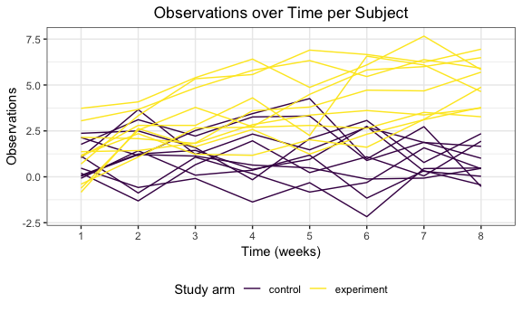

p8105\_hw5\_aar2192
================
Amadeia Rector
11/6/2018

Problem 1
=========

-   Start with a dataframe containing all file names; the list.files function will help

``` r
longitudinal_df =
    tibble(file_name = list.files(path = "./data")) 
```

-   Iterate over file names and read in data for each subject using purrr::map and saving the result as a new variable in the dataframe

``` r
  longitudinal_df =
    tibble(participant = list.files(path = "./data"),
           csv_file = str_c(path = "./data/", participant)) %>% 
    mutate(data = map(csv_file, read_csv)) %>% 
    unnest 
## Parsed with column specification:
## cols(
##   week_1 = col_double(),
##   week_2 = col_double(),
##   week_3 = col_double(),
##   week_4 = col_double(),
##   week_5 = col_double(),
##   week_6 = col_double(),
##   week_7 = col_double(),
##   week_8 = col_double()
## )
## Parsed with column specification:
## cols(
##   week_1 = col_double(),
##   week_2 = col_double(),
##   week_3 = col_double(),
##   week_4 = col_double(),
##   week_5 = col_double(),
##   week_6 = col_double(),
##   week_7 = col_double(),
##   week_8 = col_double()
## )
## Parsed with column specification:
## cols(
##   week_1 = col_double(),
##   week_2 = col_double(),
##   week_3 = col_double(),
##   week_4 = col_double(),
##   week_5 = col_double(),
##   week_6 = col_double(),
##   week_7 = col_double(),
##   week_8 = col_double()
## )
## Parsed with column specification:
## cols(
##   week_1 = col_double(),
##   week_2 = col_double(),
##   week_3 = col_double(),
##   week_4 = col_double(),
##   week_5 = col_double(),
##   week_6 = col_double(),
##   week_7 = col_double(),
##   week_8 = col_double()
## )
## Parsed with column specification:
## cols(
##   week_1 = col_double(),
##   week_2 = col_double(),
##   week_3 = col_double(),
##   week_4 = col_double(),
##   week_5 = col_double(),
##   week_6 = col_double(),
##   week_7 = col_double(),
##   week_8 = col_double()
## )
## Parsed with column specification:
## cols(
##   week_1 = col_double(),
##   week_2 = col_double(),
##   week_3 = col_double(),
##   week_4 = col_double(),
##   week_5 = col_double(),
##   week_6 = col_double(),
##   week_7 = col_double(),
##   week_8 = col_double()
## )
## Parsed with column specification:
## cols(
##   week_1 = col_double(),
##   week_2 = col_double(),
##   week_3 = col_double(),
##   week_4 = col_double(),
##   week_5 = col_double(),
##   week_6 = col_double(),
##   week_7 = col_double(),
##   week_8 = col_double()
## )
## Parsed with column specification:
## cols(
##   week_1 = col_double(),
##   week_2 = col_double(),
##   week_3 = col_double(),
##   week_4 = col_double(),
##   week_5 = col_double(),
##   week_6 = col_double(),
##   week_7 = col_double(),
##   week_8 = col_double()
## )
## Parsed with column specification:
## cols(
##   week_1 = col_double(),
##   week_2 = col_double(),
##   week_3 = col_double(),
##   week_4 = col_double(),
##   week_5 = col_double(),
##   week_6 = col_double(),
##   week_7 = col_double(),
##   week_8 = col_double()
## )
## Parsed with column specification:
## cols(
##   week_1 = col_double(),
##   week_2 = col_double(),
##   week_3 = col_double(),
##   week_4 = col_double(),
##   week_5 = col_double(),
##   week_6 = col_double(),
##   week_7 = col_double(),
##   week_8 = col_double()
## )
## Parsed with column specification:
## cols(
##   week_1 = col_double(),
##   week_2 = col_double(),
##   week_3 = col_double(),
##   week_4 = col_double(),
##   week_5 = col_double(),
##   week_6 = col_double(),
##   week_7 = col_double(),
##   week_8 = col_double()
## )
## Parsed with column specification:
## cols(
##   week_1 = col_double(),
##   week_2 = col_double(),
##   week_3 = col_double(),
##   week_4 = col_double(),
##   week_5 = col_double(),
##   week_6 = col_double(),
##   week_7 = col_double(),
##   week_8 = col_double()
## )
## Parsed with column specification:
## cols(
##   week_1 = col_double(),
##   week_2 = col_double(),
##   week_3 = col_double(),
##   week_4 = col_double(),
##   week_5 = col_double(),
##   week_6 = col_double(),
##   week_7 = col_double(),
##   week_8 = col_double()
## )
## Parsed with column specification:
## cols(
##   week_1 = col_double(),
##   week_2 = col_double(),
##   week_3 = col_double(),
##   week_4 = col_double(),
##   week_5 = col_double(),
##   week_6 = col_double(),
##   week_7 = col_integer(),
##   week_8 = col_double()
## )
## Parsed with column specification:
## cols(
##   week_1 = col_double(),
##   week_2 = col_double(),
##   week_3 = col_double(),
##   week_4 = col_double(),
##   week_5 = col_double(),
##   week_6 = col_double(),
##   week_7 = col_double(),
##   week_8 = col_double()
## )
## Parsed with column specification:
## cols(
##   week_1 = col_double(),
##   week_2 = col_double(),
##   week_3 = col_double(),
##   week_4 = col_double(),
##   week_5 = col_double(),
##   week_6 = col_double(),
##   week_7 = col_double(),
##   week_8 = col_double()
## )
## Parsed with column specification:
## cols(
##   week_1 = col_double(),
##   week_2 = col_double(),
##   week_3 = col_double(),
##   week_4 = col_double(),
##   week_5 = col_double(),
##   week_6 = col_double(),
##   week_7 = col_double(),
##   week_8 = col_double()
## )
## Parsed with column specification:
## cols(
##   week_1 = col_double(),
##   week_2 = col_double(),
##   week_3 = col_double(),
##   week_4 = col_double(),
##   week_5 = col_double(),
##   week_6 = col_double(),
##   week_7 = col_double(),
##   week_8 = col_double()
## )
## Parsed with column specification:
## cols(
##   week_1 = col_double(),
##   week_2 = col_double(),
##   week_3 = col_double(),
##   week_4 = col_double(),
##   week_5 = col_double(),
##   week_6 = col_double(),
##   week_7 = col_double(),
##   week_8 = col_double()
## )
## Parsed with column specification:
## cols(
##   week_1 = col_double(),
##   week_2 = col_double(),
##   week_3 = col_double(),
##   week_4 = col_double(),
##   week_5 = col_double(),
##   week_6 = col_double(),
##   week_7 = col_double(),
##   week_8 = col_double()
## )
```

-   Tidy the result; manipulate file names to include control arm and subject ID, make sure weekly observations are “tidy”, and do any other tidying that’s necessary

``` r
longitudinal_df =
    tibble(participant = list.files(path = "./data"),
           csv_file = str_c(path = "./data/", participant)) %>% 
    mutate(data = map(csv_file, read_csv)) %>% 
    unnest %>%
    separate(participant, into = c("participant_id", "trash"), sep = ".c") %>% 
  mutate(study_arm = participant_id) %>%
  mutate(study_arm = str_replace(study_arm, "con", "control")) %>% 
  mutate(study_arm = str_replace(study_arm, "exp", "experiment")) %>% 
  separate(study_arm, into = c("study_arm", "trash1"), sep = "_") %>% 
  select(participant_id, study_arm, everything(), -starts_with("trash"), -csv_file) %>% 
  janitor::clean_names() %>% 
  gather(key = week, value = observation, week_1:week_8) %>% 
  separate(week, into = c("trash", "week"), sep = "_") %>% 
  select(-trash) 
## Parsed with column specification:
## cols(
##   week_1 = col_double(),
##   week_2 = col_double(),
##   week_3 = col_double(),
##   week_4 = col_double(),
##   week_5 = col_double(),
##   week_6 = col_double(),
##   week_7 = col_double(),
##   week_8 = col_double()
## )
## Parsed with column specification:
## cols(
##   week_1 = col_double(),
##   week_2 = col_double(),
##   week_3 = col_double(),
##   week_4 = col_double(),
##   week_5 = col_double(),
##   week_6 = col_double(),
##   week_7 = col_double(),
##   week_8 = col_double()
## )
## Parsed with column specification:
## cols(
##   week_1 = col_double(),
##   week_2 = col_double(),
##   week_3 = col_double(),
##   week_4 = col_double(),
##   week_5 = col_double(),
##   week_6 = col_double(),
##   week_7 = col_double(),
##   week_8 = col_double()
## )
## Parsed with column specification:
## cols(
##   week_1 = col_double(),
##   week_2 = col_double(),
##   week_3 = col_double(),
##   week_4 = col_double(),
##   week_5 = col_double(),
##   week_6 = col_double(),
##   week_7 = col_double(),
##   week_8 = col_double()
## )
## Parsed with column specification:
## cols(
##   week_1 = col_double(),
##   week_2 = col_double(),
##   week_3 = col_double(),
##   week_4 = col_double(),
##   week_5 = col_double(),
##   week_6 = col_double(),
##   week_7 = col_double(),
##   week_8 = col_double()
## )
## Parsed with column specification:
## cols(
##   week_1 = col_double(),
##   week_2 = col_double(),
##   week_3 = col_double(),
##   week_4 = col_double(),
##   week_5 = col_double(),
##   week_6 = col_double(),
##   week_7 = col_double(),
##   week_8 = col_double()
## )
## Parsed with column specification:
## cols(
##   week_1 = col_double(),
##   week_2 = col_double(),
##   week_3 = col_double(),
##   week_4 = col_double(),
##   week_5 = col_double(),
##   week_6 = col_double(),
##   week_7 = col_double(),
##   week_8 = col_double()
## )
## Parsed with column specification:
## cols(
##   week_1 = col_double(),
##   week_2 = col_double(),
##   week_3 = col_double(),
##   week_4 = col_double(),
##   week_5 = col_double(),
##   week_6 = col_double(),
##   week_7 = col_double(),
##   week_8 = col_double()
## )
## Parsed with column specification:
## cols(
##   week_1 = col_double(),
##   week_2 = col_double(),
##   week_3 = col_double(),
##   week_4 = col_double(),
##   week_5 = col_double(),
##   week_6 = col_double(),
##   week_7 = col_double(),
##   week_8 = col_double()
## )
## Parsed with column specification:
## cols(
##   week_1 = col_double(),
##   week_2 = col_double(),
##   week_3 = col_double(),
##   week_4 = col_double(),
##   week_5 = col_double(),
##   week_6 = col_double(),
##   week_7 = col_double(),
##   week_8 = col_double()
## )
## Parsed with column specification:
## cols(
##   week_1 = col_double(),
##   week_2 = col_double(),
##   week_3 = col_double(),
##   week_4 = col_double(),
##   week_5 = col_double(),
##   week_6 = col_double(),
##   week_7 = col_double(),
##   week_8 = col_double()
## )
## Parsed with column specification:
## cols(
##   week_1 = col_double(),
##   week_2 = col_double(),
##   week_3 = col_double(),
##   week_4 = col_double(),
##   week_5 = col_double(),
##   week_6 = col_double(),
##   week_7 = col_double(),
##   week_8 = col_double()
## )
## Parsed with column specification:
## cols(
##   week_1 = col_double(),
##   week_2 = col_double(),
##   week_3 = col_double(),
##   week_4 = col_double(),
##   week_5 = col_double(),
##   week_6 = col_double(),
##   week_7 = col_double(),
##   week_8 = col_double()
## )
## Parsed with column specification:
## cols(
##   week_1 = col_double(),
##   week_2 = col_double(),
##   week_3 = col_double(),
##   week_4 = col_double(),
##   week_5 = col_double(),
##   week_6 = col_double(),
##   week_7 = col_integer(),
##   week_8 = col_double()
## )
## Parsed with column specification:
## cols(
##   week_1 = col_double(),
##   week_2 = col_double(),
##   week_3 = col_double(),
##   week_4 = col_double(),
##   week_5 = col_double(),
##   week_6 = col_double(),
##   week_7 = col_double(),
##   week_8 = col_double()
## )
## Parsed with column specification:
## cols(
##   week_1 = col_double(),
##   week_2 = col_double(),
##   week_3 = col_double(),
##   week_4 = col_double(),
##   week_5 = col_double(),
##   week_6 = col_double(),
##   week_7 = col_double(),
##   week_8 = col_double()
## )
## Parsed with column specification:
## cols(
##   week_1 = col_double(),
##   week_2 = col_double(),
##   week_3 = col_double(),
##   week_4 = col_double(),
##   week_5 = col_double(),
##   week_6 = col_double(),
##   week_7 = col_double(),
##   week_8 = col_double()
## )
## Parsed with column specification:
## cols(
##   week_1 = col_double(),
##   week_2 = col_double(),
##   week_3 = col_double(),
##   week_4 = col_double(),
##   week_5 = col_double(),
##   week_6 = col_double(),
##   week_7 = col_double(),
##   week_8 = col_double()
## )
## Parsed with column specification:
## cols(
##   week_1 = col_double(),
##   week_2 = col_double(),
##   week_3 = col_double(),
##   week_4 = col_double(),
##   week_5 = col_double(),
##   week_6 = col_double(),
##   week_7 = col_double(),
##   week_8 = col_double()
## )
## Parsed with column specification:
## cols(
##   week_1 = col_double(),
##   week_2 = col_double(),
##   week_3 = col_double(),
##   week_4 = col_double(),
##   week_5 = col_double(),
##   week_6 = col_double(),
##   week_7 = col_double(),
##   week_8 = col_double()
## )
```

-   Make a spaghetti plot showing observations on each subject over time, and comment on differences between groups.

``` r
longitudinal_df %>% 
  ggplot(aes(x = week, y = observation, group = participant_id, color = study_arm)) +
  geom_path() + 
  labs(title = "Observations over Time per Subject",
       x = "Time (weeks)",
       y = "Observations") + 
  viridis::scale_color_viridis(
    name = "Study arm", 
    discrete = TRUE)
```


